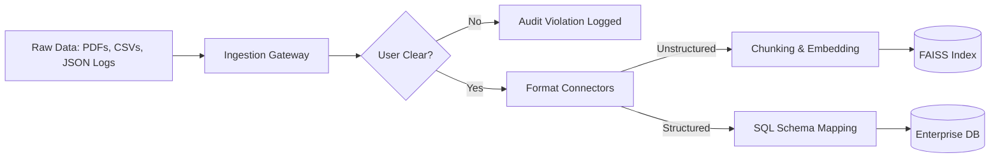

# Enterprise RAG System - Architecture Diagram & Data Flow

This document details the production-grade architecture of **ApexRAG Enterprise**, illustrating component interactions, data ingestion pipelines, context-aware routing, and strict Role-Based Access Control (RBAC).

## 1. High-Level Architectural Flow

```mermaid
graph TD
    User([Enterprise User / SSO]) -->|HTTP / REST| API[FastAPI Gateway]
    
    subclass Auth
    API -->|Headers / JWT| RBAC[RBAC Policy Engine]
    RBAC -->|Validate & Audit| AuditDB[(SQL Audit & User DB)]
    end

    subclass Routing
    RBAC -->|Authorized Request| Router[Context-Aware Hybrid Router]
    Router -->|Intent: Unstructured RAG| VecStore[(FAISS / BM25 Vector Store)]
    Router -->|Intent: Structured SQL| SQLDB[(Structured SQLite / Postgres Silos)]
    end

    subclass Synthesis
    VecStore --> Reranker[Enterprise Reranker & Weighting]
    SQLDB --> Reranker
    Reranker --> LLM[LLM Generator & Uncertainty Scoring]
    LLM --> Response[Explainable Output with Citations]
    end
```

## 2. Ingestion Pipeline Architecture



## 3. Core Component Responsibilities

1. **API Gateway (`main.py`, `routes.py`)**: Handles incoming REST requests, CORS, and Prometheus metrics scraping.
2. **RBAC Policy Engine (`rbac.py`)**: Intercepts requests, validates simulated LDAP/SSO headers, checks requested data silo clearance against predefined matrices, and records access attempts.
3. **Context-Aware Router (`hybrid_search.py`)**: Uses keyword heuristics and regex patterns to route analytical queries (e.g., financial revenue computations) to structured SQL engines, and semantic knowledge queries to vector spaces.
4. **Reranker (`reranker.py`)**: Applies Reciprocal Rank Fusion (RRF) and custom weighting coefficients to merge BM25 keyword rankings with FAISS L2 distance scores.
5. **Generator & Uncertainty Engine (`llm.py`)**: Evaluates retrieved chunks, computes a statistical confidence score based on term coverage and distance metrics, and formats responses with explicit citation mappings `[1]`, `[2]`.
